PROJECT HUMANITY

[Population changes across African capital cities](https://youtu.be/DdUtOm7Y5x4)
#Algiers #Luanda #Porto-Novo #Gaborone #Ouagadougou #Bujumbura #Praia #Yaounde #Bangui #N'Djamena #Moroni #Brazzaville #Yamoussoukro #Kinshasa #Djibouti
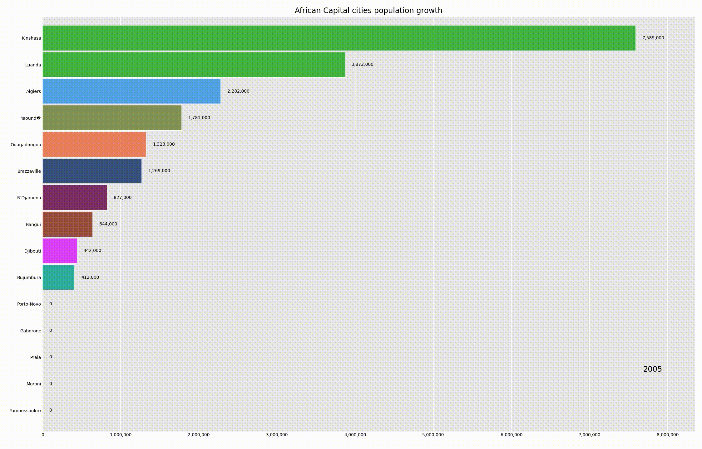

#Cairo #Malabo #Asmara #Mbabane #AddisAbaba #Libreville #Banjul #Accra #Conakry #Bissau #Nairobi #Maseru #Monrovia #Tripoli #Antananarivo

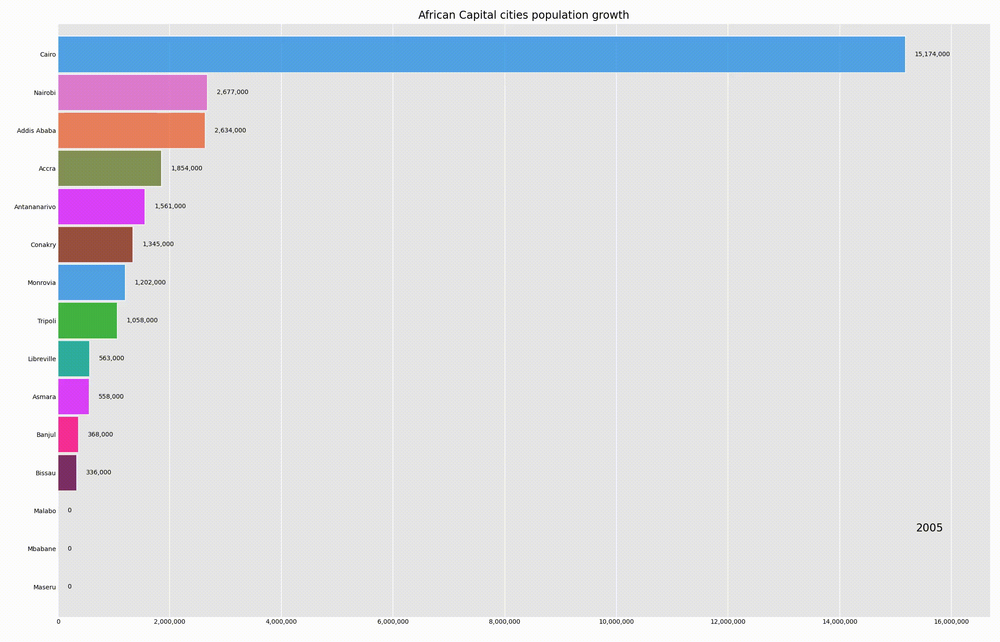
#Lilongwe #Bamako #Nouakchott #Port Louis #Rabat #Maputo #Windhoek #Niamey,Abuja,#Kigali #Sao Tome #Dakar #Victoria #Freetown #Mogadishu
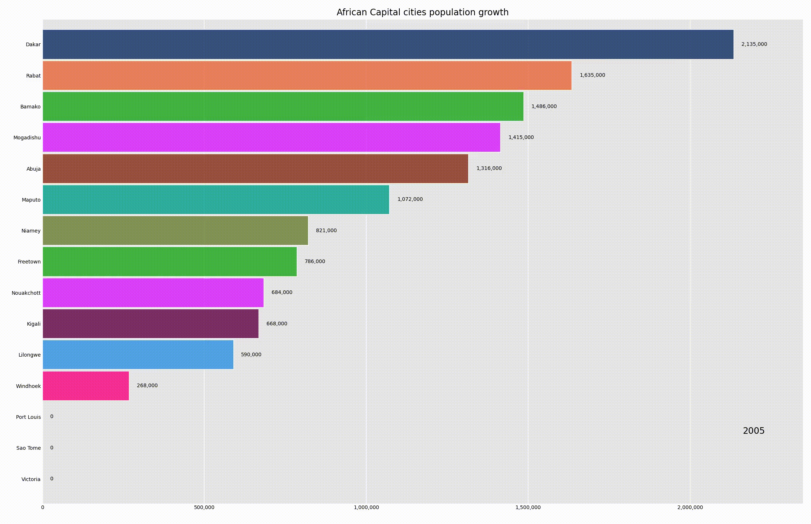

#Pretoria #Juba #Khartoum #Lome #Tunis #Kampala #Dodoma #Lusaka #Harare
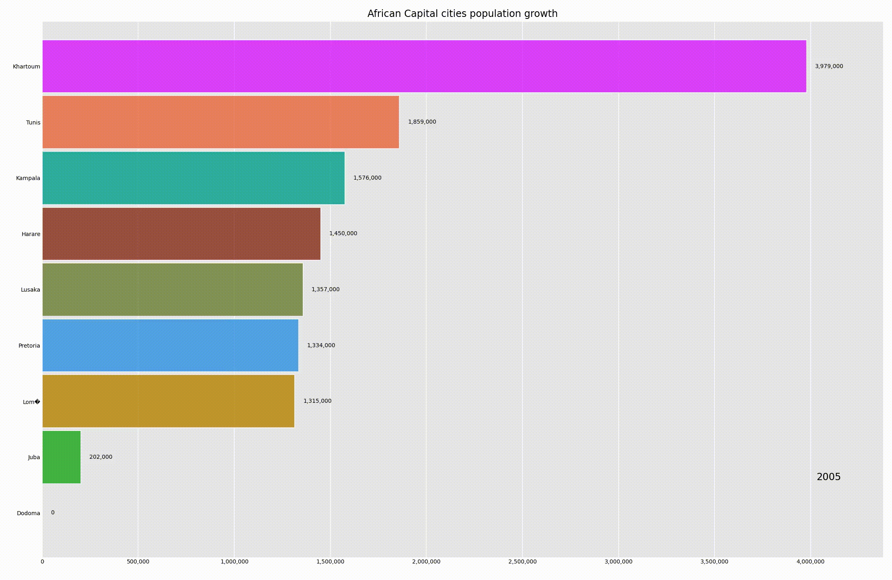

#Kabul#Tirana#Algiers#Pago Pago#Andorra la Vella#Luanda#The Valley#Saint John's#Buenos Aires#Yerevan#Oranjestad#Canberra#Vienna#Baku#Nassau
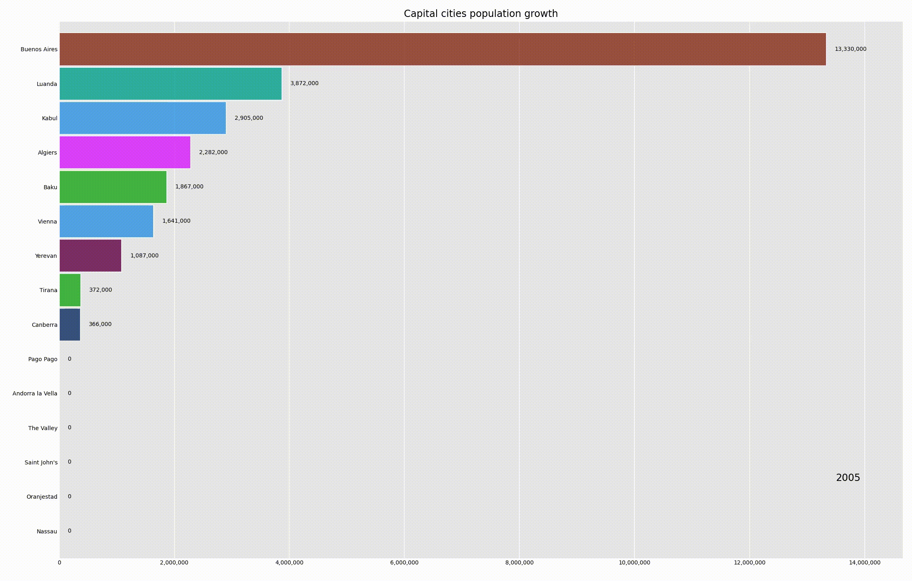
#Manama#Dhaka#Bridgetown#Minsk#Brussels#Belmopan#Porto-Novo#Hamilton#Thimphu#Sucre#Kralendijk#Sarajevo#Gaborone#Brasilia#Road Town
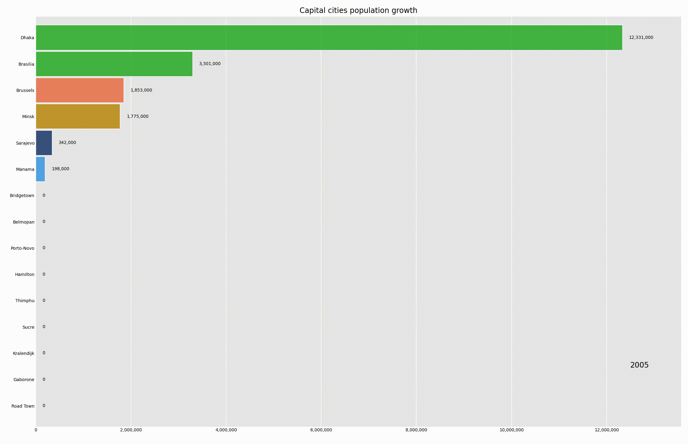
#Bandar Seri Begawan#Sofia#Ouagadougou#Bujumbura#Praia#Phnom Penh#Yaoundé#Ottawa#George Town#Bangui#N'Djamena#Saint Helier#Santiago#Beijing#Hong Kong#Macao#Bogota#Moroni#Brazzaville #Avarua
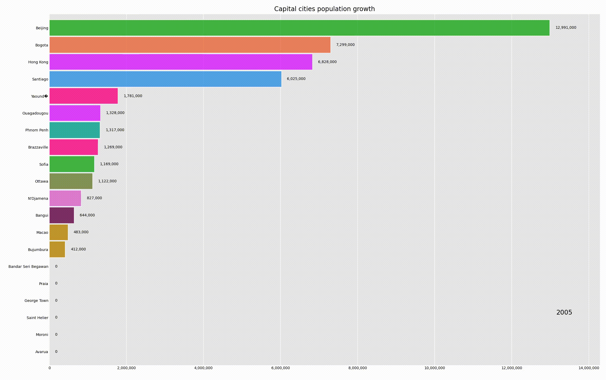
#San José#Yamoussoukro#Zagreb#Havana#Willemstad#Nicosia#Prague#Pyongyang#Kinshasa#Copenhagen#Djibouti#Roseau#Santo Domingo#Quito#Cairo#San Salvador#Malabo#Asmara#Tallinn #Mbabane
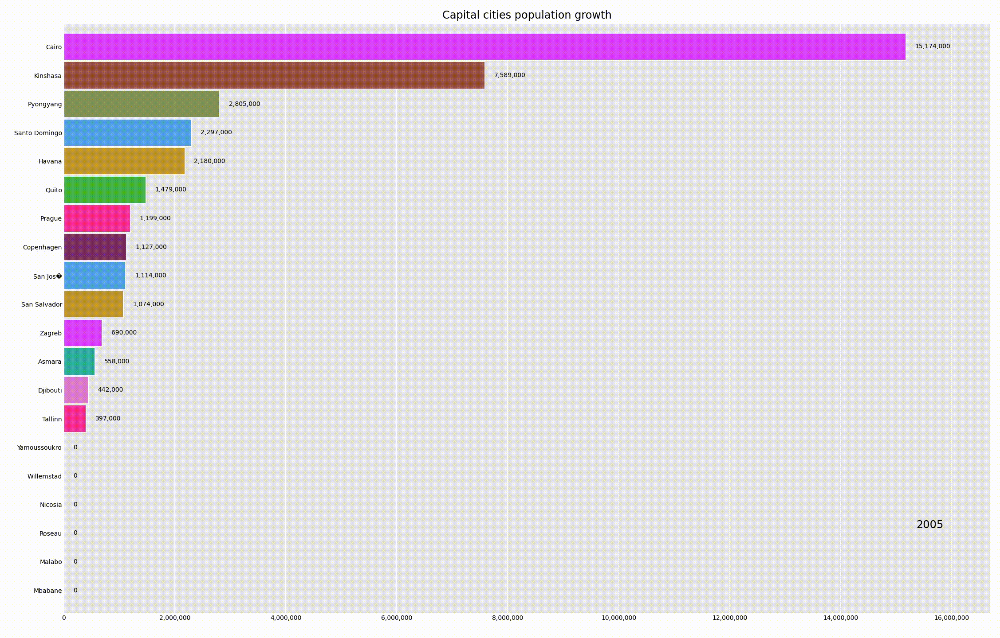
#Addis Ababa#Stanley#Tórshavn#Suva#Helsinki#Paris#Cayenne#Papeete#Libreville#Banjul#Tbilisi#Berlin#Accra#Gibraltar#Athens#Nuuk#Saint George's#Guatemala City#Basse-Terre#Hagåtña
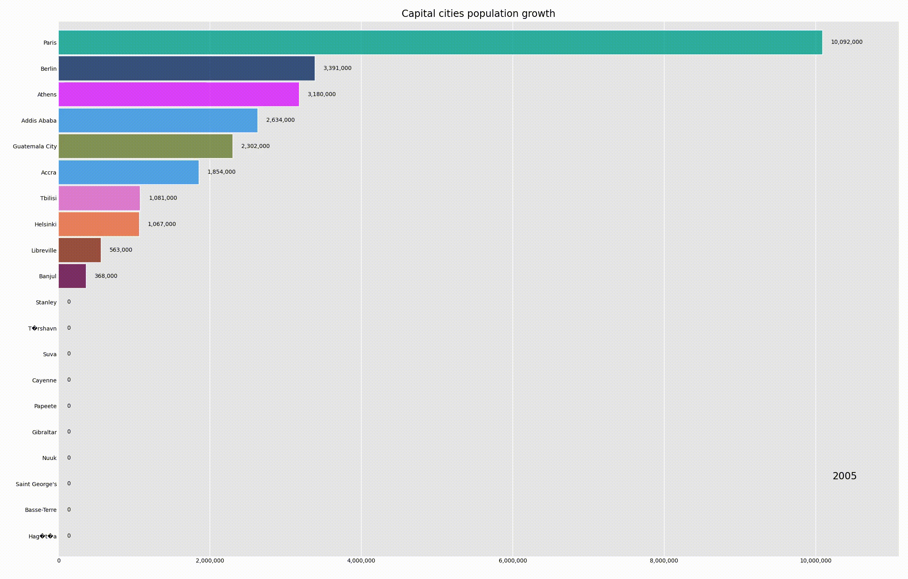
#Conakry#Bissau#Georgetown#Port-au-Prince#Vatican City#Tegucigalpa#Budapest#Reykjavik#New Delhi#Jakarta#Tehran#Baghdad#Dublin#Douglas#Jerusalem#Rome#Kingston #Tokyo#Amman#Astana
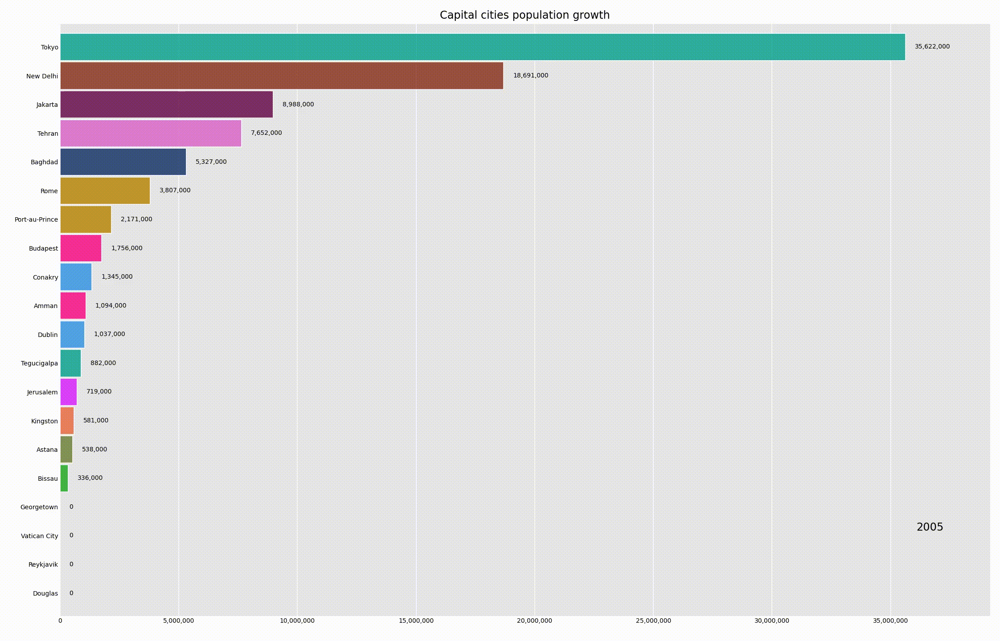
#Nairobi#Bairiki#Kuwait City#Bishkek#Vientiane#Riga#Beirut#Maseru#Monrovia#Tripoli#Vaduz#Vilnius#Luxembourg#Antananarivo#Lilongwe#Kuala Lumpur#Bamako#Male#Valletta#Majuro
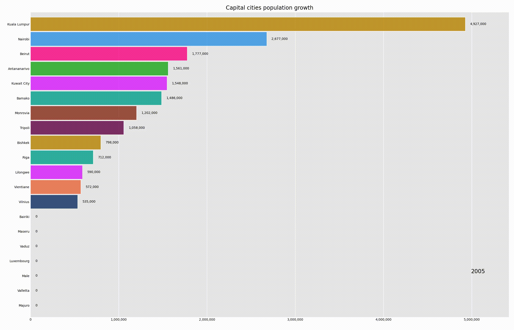
#Fort-de-France#Nouakchott#Port Louis#Mamoudzou#Mexico City#Palikir#Monaco#Ulaanbaatar#Podgorica#Brades Estate#Rabat#Maputo#Nay Pyi Taw#Windhoek#Yaren#Kathmandu#Amsterdam #Nouméa #Wellington#Managua
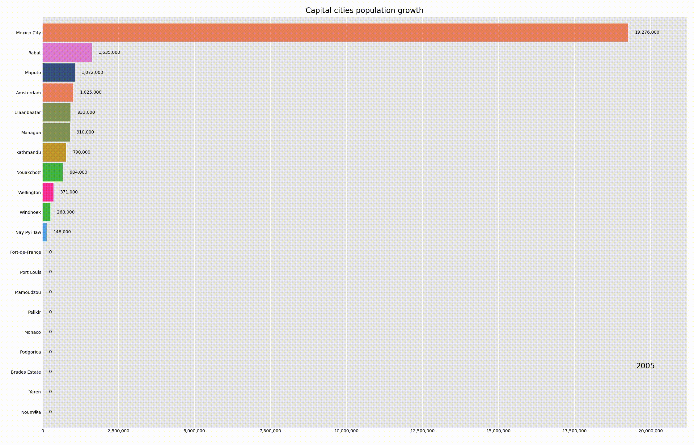
#Niamey#Abuja#Alofi#Garapan#Oslo#Muscat#Islamabad#Melekeok#Panama City#Port Moresby#Asunción#Lima#Manila#Warsaw#Lisbon#San Juan#Doha #Seoul#Chisinau#Saint-Denis
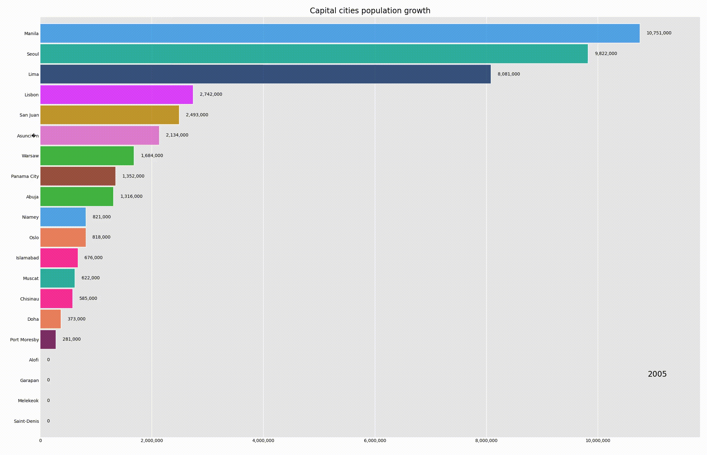
#Bucharest#Moscow#Kigali#Jamestown#Basseterre#Castries#Saint-Pierre#Kingstown#Apia#San Marino#Sao Tome#Riyadh#Dakar#Belgrade#Victoria#Freetown#Singapore #Philipsburg#Bratislava#Ljubljana
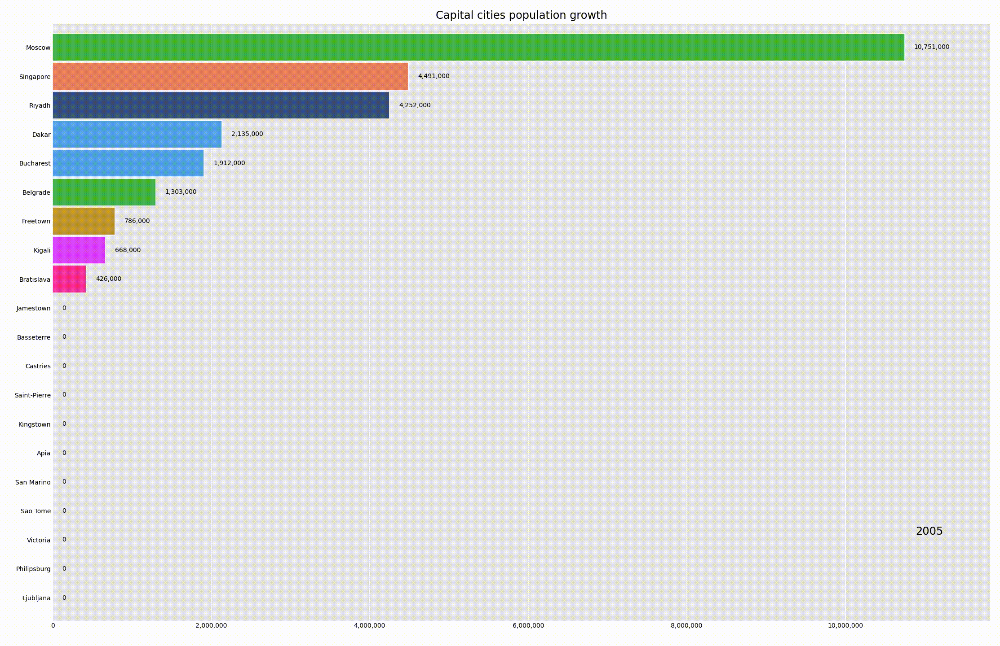
#Honiara#Mogadishu#Pretoria#Juba#Madrid#Colombo#East Jerusalem#Khartoum#Paramaribo#Stockholm#Bern#Damascus#Dushanbe#Bangkok#Skopje#Nuku'alofa#Dili#Lomé #Port of Spain#Tunis
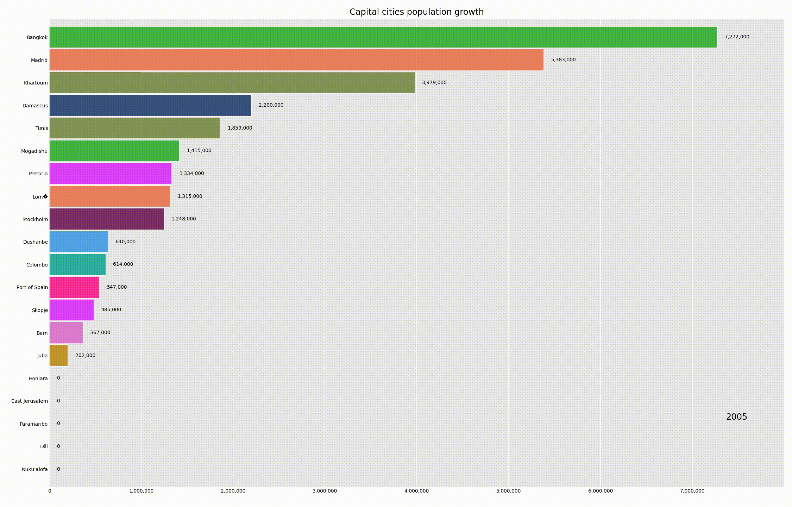
#Ankara#Ashgabat#Cockburn Town#Funafuti#Kampala#Kyiv#Abu Dhabi#London#Dodoma#"Washington, D.C."#Charlotte Amalie#Montevideo#Tashkent#Port Vila#Caracas#Hanoi#Matu-Utu#El Aaiún#Sana'a#Lusaka#Harare
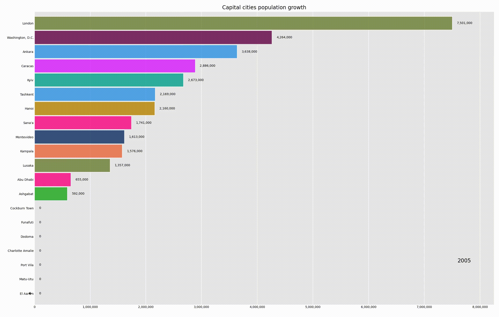
