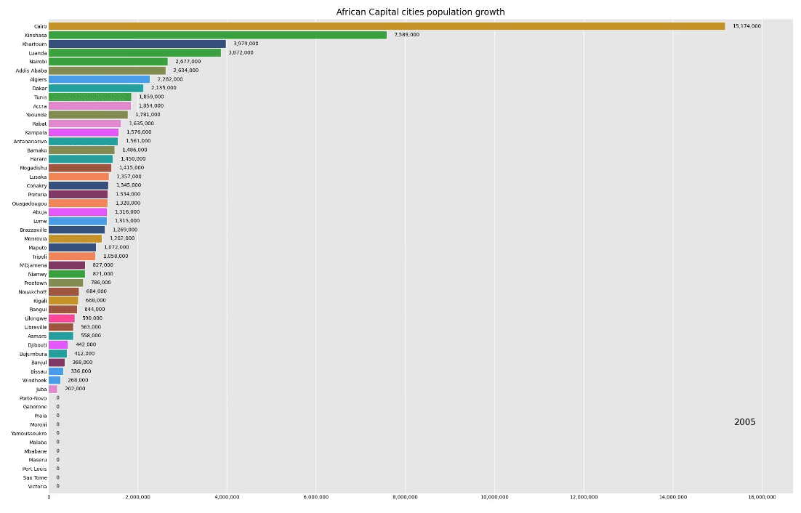

PROJECT HUMANITY
UN DATA ANALYSIS
This repo contains data analysis and visualization to obtain actionable insights that will either transform the world, put me out there, or mitigate challenges facing humanity in our world today.
We focus on the data from KNBS and UN.
The goal has always been to be part of the UN family and transform the world while at it.

This project uses a react, Vite and django combo for the user interface

[Population changes across African capital cities](https://youtu.be/DdUtOm7Y5x4)

